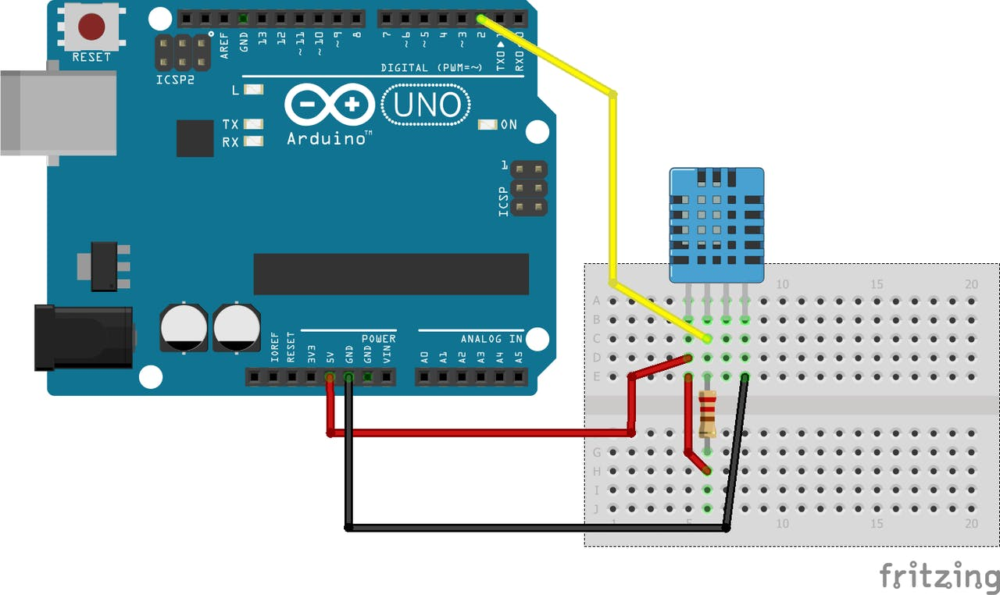
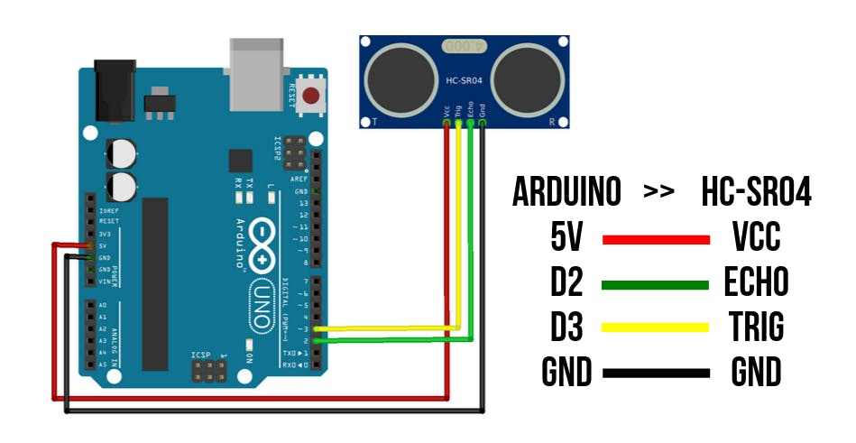
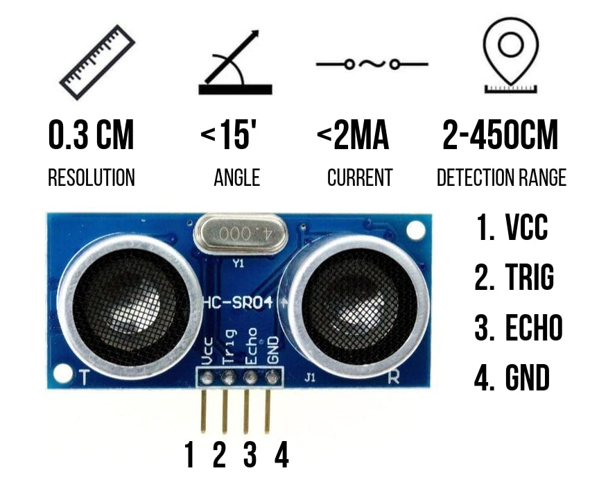

<html>
<head>

</head>
<body>
<h1>Learn how to programming with Arduino Uno</h1>

 Τμήμα Πληροφορικής & Τηλεπικοινωνιών 

Αρχιτεκτονική Υπολογιστών Εργαστήριο - 3ο Εξάμηνο

 Κωνσταντίνος Σακκάς

Copyright © 2021 Κωνσταντίνος Σακκάς. Με την επιφύλαξη παντός δικαιώματος

<h3>Εισαγωγή στο Arduino Uno και στην Wiring</h3>
<ul>
<li><a href="https://github.com/ksakkas/Learn-Wiring-with-Arduino-Mega/blob/master/Code/Greek/hello.ino">Hello World</a></li>
<li><a href="https://github.com/ksakkas/Learn-Wiring-with-Arduino-Mega/blob/master/Code/Greek/print.ino">Η εντολή print</a></li>
<li><a href="https://github.com/ksakkas/Learn-Wiring-with-Arduino-Mega/blob/master/Code/Greek/println.ino">Η εντολή println</a></li>
<li><a href="https://github.com/ksakkas/Learn-Wiring-with-Arduino-Mega/blob/master/Code/Greek/if.ino">Η εντολή if</a></li>
<li><a href="https://github.com/ksakkas/Learn-Wiring-with-Arduino-Mega/blob/master/Code/Greek/for.ino">Η εντολή for</a></li>
<li><a href="https://github.com/ksakkas/Learn-Wiring-with-Arduino-Mega/blob/master/Code/Greek/while.ino">Η εντολή while</a></li>
<li><a href="https://github.com/ksakkas/Learn-Wiring-with-Arduino-Mega/blob/master/Code/Greek/blink.ino">Blink Led</a></li> 
</ul>
 
 <h3>Ασκήσεις Εργαστηρίου</h3>
<ul>
 <li><a href="https://github.com/ksakkas/Learn-Wiring-with-Arduino-Mega/blob/master/Lab/lab3_1.ino">Εμφάνιση Δεδομένων (3.1)</a></li>
 <li><a href="https://github.com/ksakkas/Learn-Wiring-with-Arduino-Mega/blob/master/Lab/lab3_2.ino">Εμφάνιση και Ανάγνωση Δεδομένων (3.2)</a></li>
 <li><a href="https://github.com/ksakkas/Learn-Wiring-with-Arduino-Mega/blob/master/Lab/lab3_3.ino">Εμφάνιση, Ανάγνωση Δεδομένων και χρήση led (3.3 - Θερμοκρασία)</a></li>

 </ul>
 
   <h3>Ασκήσεις Εργαστηρίου με Αισθητήρες</h3>
<ul>
 <li><a href="https://github.com/ksakkas/Learn-Wiring-with-Arduino-Mega/blob/master/Lab/dht11.ino">Αισθητήρας DHT11</a></li>

 
 <li><a href="https://github.com/ksakkas/Learn-Wiring-with-Arduino-Mega/blob/master/Lab/ultrasonic.ino">Αισθητήρας Ultrasonic HC-SR04</a></li>
 
 

 </ul>
 
   
 
 <h3>Βιβλιοθήκες για Arduino</h3>
 <ul>
  <li><a href="https://ksakkas.github.io/Learn-Wiring-with-Arduino-Uno/time">Η Βιβλιοθήκη Time</a></li>
 </ul>

 
 
</body>
</html>
